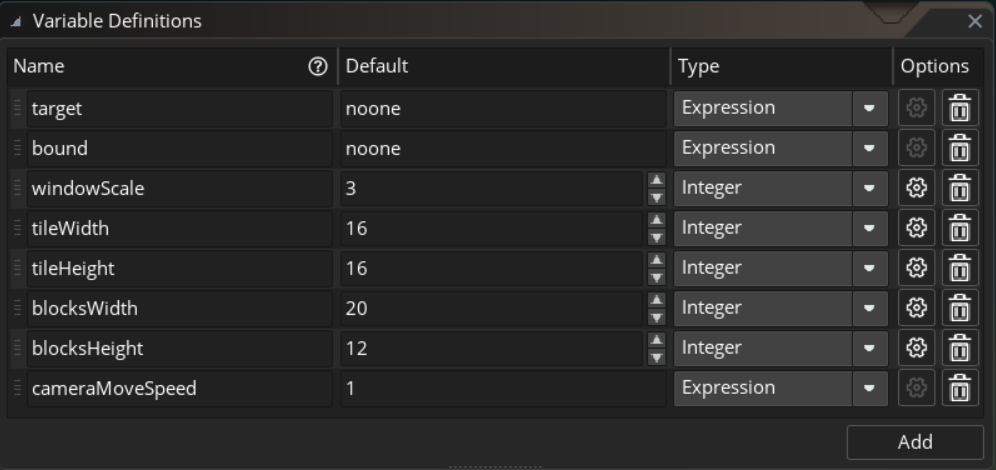

# GMS2Camera
GMS2简易相机

## 可配置参数如下

名称 | 功能
--- | ---
target | 相机跟踪的对象，设为noone则为取消跟踪
bound | 相机移动受限边框，到达边界就无法再移动了
windowScale | 窗口放大系数，如果设置成1就是原始大小
tileWidth | tile的宽
tileHeight | tile的高
blocksWidth | 希望相机显示多少个tile的宽
blocksHeight | 希望相机显示多少个tile的高
cameraMoveSpeed | 跟踪系数，有效值为0~1之间的数，为1的话就是没有过度动画直接设置到跟踪对象的位置
