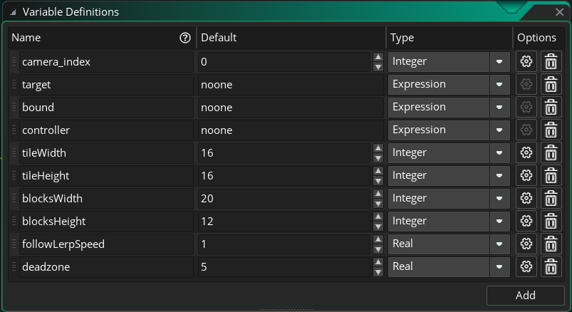

# GMS2Camera
GMS2简易相机

## 参考

### 配置项


名称 | 功能
--- | ---
camera_index | 相机在view_camera中的索引
target | 相机跟踪的对象，设为noone则为取消跟踪
bound | 相机移动受限边框，到达边界就无法再移动了
tileWidth | tile的宽
tileHeight | tile的高
blocksWidth | 希望相机显示多少个tile的宽
blocksHeight | 希望相机显示多少个tile的高
followLerpSpeed | 跟踪系数，有效值为0~1之间的数，为1的话就是没有过度动画直接设置到跟踪对象的位置
deadzone | 相机移动的死区，进入死区后相机会直接移动到目的地

### 方法
#### 跟踪目标
```gms2CameraFollow(cam, target)```

参数: 
- cam: 一个obj_Camera对象
- target: 要跟踪的对象

#### 停止跟踪目标
```gms2CameraStopFollow(cam)```

参数: 
- cam: 一个obj_Camera对象

#### 设置相机位置
```gms2CameraSetPosition(camera, x, y)```

参数: 
- cam: 一个obj_Camera对象
- x: 目标位置横坐标
- y: 目标位置纵坐标

#### 设置相机旋转
```gms2CameraSetRotate(cam, angle)```

参数: 
- cam: 一个obj_Camera对象
- angle: 旋转的角度

#### 设置相机缩放
```gms2CameraSetZoom(cam, zoom)```

参数: 
- cam: 一个obj_Camera对象
- zoom: 比例值，1为原始比例

#### 设置相机摇晃
```gms2CameraShake(cam, amount, duration)```

参数: 
- cam: 一个obj_Camera对象
- amount: 摇晃幅度
- duration: 持续时间

#### 相机平移
```gms2CameraMove(cam, expectX, expectY, speed, ignoreBound)```

参数: 
- cam: 一个obj_Camera对象
- expectX: 期望位置横坐标
- expectY: 期望位置纵坐标
- speed: 移动速度
- ignoreBound: 是否忽略相机移动受限边框

#### 相机线性插值平移
```gms2CameraLerp(cam, expectX, expectY, speed, ignoreBound)```

参数: 
- cam: 一个obj_Camera对象
- expectX: 期望位置横坐标
- expectY: 期望位置纵坐标
- speed: 插值比例，0~1的数
- ignoreBound: 是否忽略相机移动受限边框
